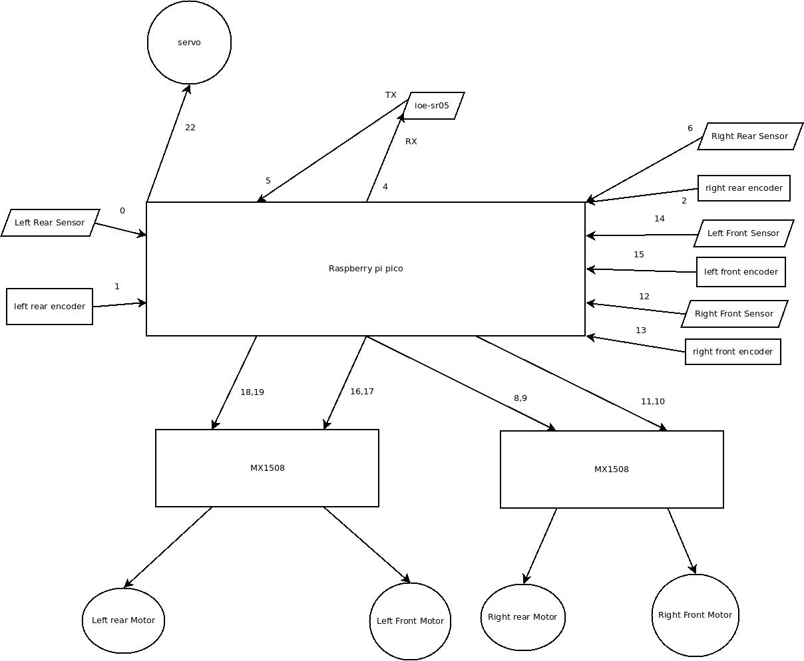

# Raspberry PICO W robot using 4wd chassy

This is written in micropython wifi_path_ioe_sr05

This robot is controlled using [desktop QT application](https://github.com/gdimitriu/swarm_robots/tree/main/robot_control_center)

This had:

 - 4 encoders (one for each wheel)
 
 - 4 distance Ir sensors (two in front and two rear)
 
 - servo
 
 - IOE_SR05 ultrasonic sensor
 
### Hardware

The power for round is 3.7V LiIon.

The logical connections are:

