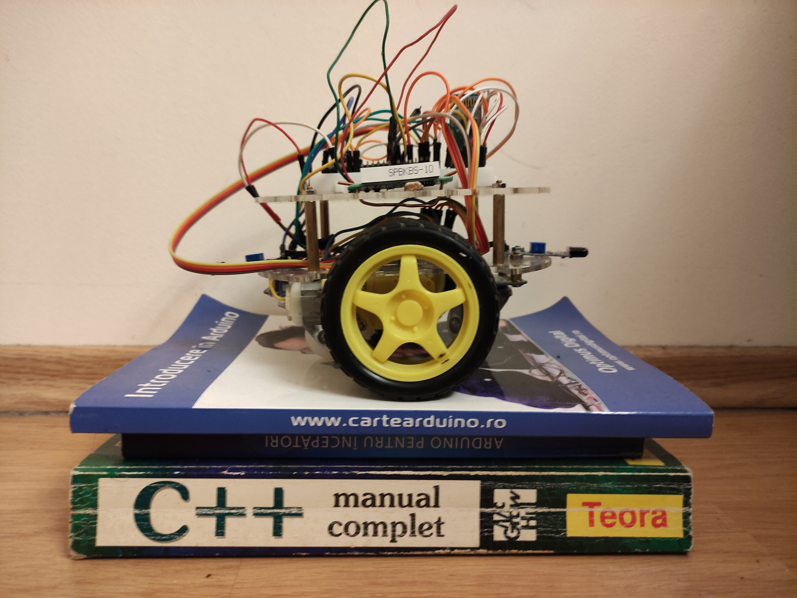
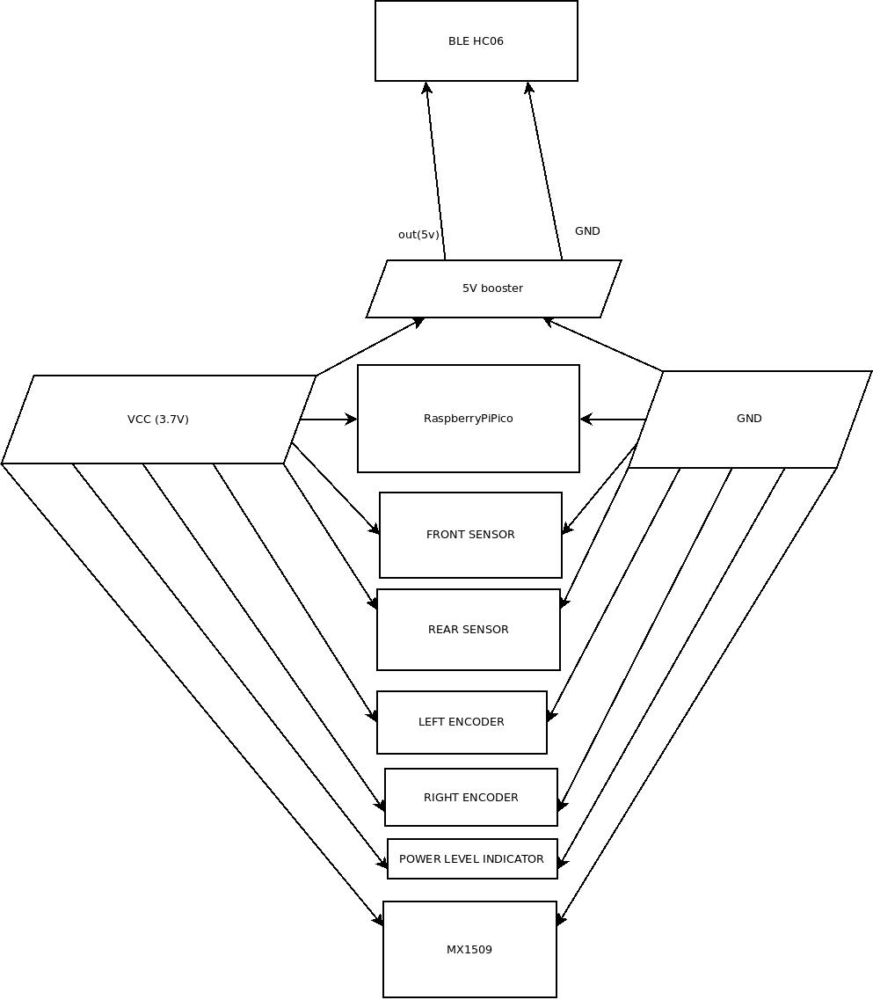
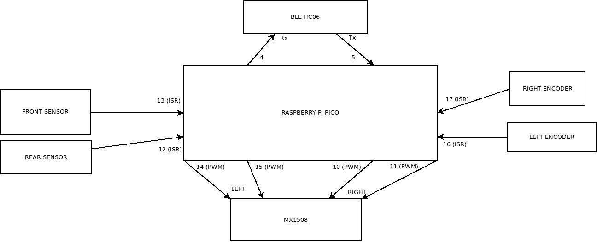

# raspberryPicoDroids

## Droid (Robots) using raspberry pico

Those robots are made unsing zumo or round platform.

They have two wheel drive, encoders and front and rear sensors and BLE for interactions.

## This droid could be controlled by the [android application](https://github.com/gdimitriu/DroidControlCenter) or by any BLE application.

## Hardware

The power for round is 3.7V LiIon.

The logical connections for round are:

## The encoder_sensors_ble is simpler version which does not have path navigation.

## The same commands are also subset of commands for all droids.

 If an object is in front when the droid is moving forward it will stop until another unconficting command is given.
 
 If an object is in rear when the droid is moving in reverse it will stop until another unconficting command is given.

 - V# return the maximum power allowed.
 
 - v# return the minimum power allowed.
 
 - c# return the current power.
 
 - C# return the number of count for each encoder.
 
 - R# reset the counter for each encoder.
 
 - b# break the engines.
 
 - Vxxx# set the maximum power to xxx.
 
 - vxxx# set the minimum power to xxx.
 
 - cxxx# set the current power to xxx.
 
 - Mxxx,yyy# move or rotate with current power this is used by droidControlCenter when a human use the arrows:
	- for xxx < 0 it will move in reverse
	- for xxx > 0 it will move forward
	- for yyy < 0 it will rotate left
	- for yyy > 0 it will rotate right
	- for xxx = 0 and yyy = 0 it will coast
 
 - mxxx,yyy# move or rotate with current power with specific distance or degree:
	- for xxx < 0 it will move in reverse for -xxx cm
	- for xxx > 0 it will move forward for xxx cm
	- for yyy < 0 it will rotate left with -yyy degrees
	- for yyy > 0 it will rotate right with yyy degrees
	- for xxx = 0 and yyy = 0 it will coast

