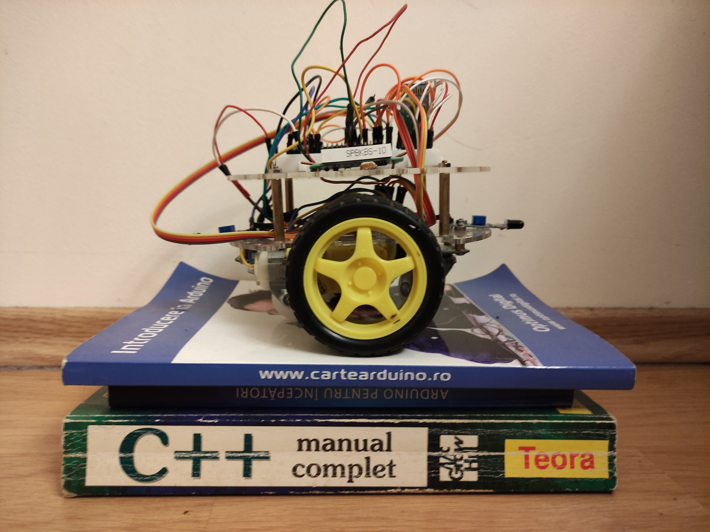
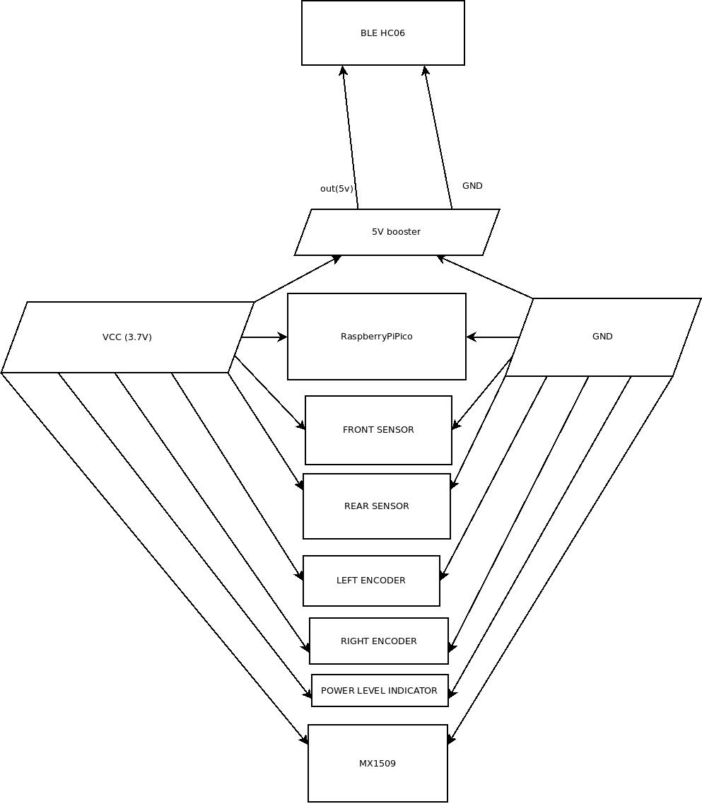
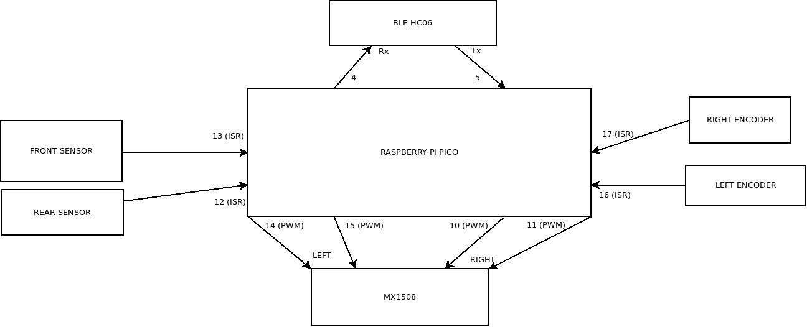

# Raspberry Pico (normal or W) using round chassy

They have two wheel drive, encoders and front and rear sensors and BLE for interactions.

## This droid could be controlled by the [android application](https://github.com/gdimitriu/DroidControlCenter) or by any BLE application.

### Hardware

The power for round is 3.7V LiIon.

The logical connections for round are:

### The encoder_sensors_ble is simpler version which does not have path navigation.

## path_navigation_wifi

This robot is controlled using [desktop QT application](https://github.com/gdimitriu/swarm_robots/tree/main/robot_control_center)
